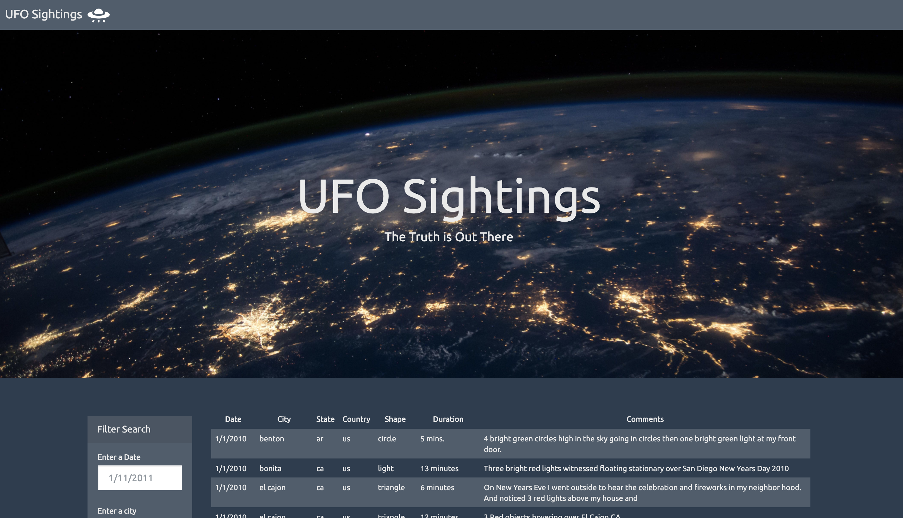

# javascript-challenge - JavaScript and DOM Manipulation
Use `JavaScript`,`HTML/CSS`, `D3.js` to manipulate and represent a dataset about the past UFO Sightings dynamically on the web pages

## Navigation of the repo: Submission
The completed files [index.html](UFO-level-1/index.html) and [app.js](UFO-level-1/static/js/app.js) are in the CompleteCode directory.

- - -

## Objectives
* to create a user-friendly table dynamically based upon the [provided UFO Sightings dataset](UFO-level-1/static/js/data.js); the potential users should be able to filter this table for the specific values of their interest

## Tasks

### Level 1: Automatic Table and Date Search
* Create a basic HTML web page.
* Using the UFO dataset provided in the form of an array of JavaScript objects, write code that appends a table to your web page and then adds new rows of data for each UFO sighting.
  * a column for `date/time`, `city`, `state`, `country`, `shape`, and `comment` each at the very least
* Use a date form in your HTML document and write JavaScript code that will listen for events and search through the `date/time` column to find rows that match user input.

### Level 2: Multiple Search Categories
* Complete all of Level 1 criteria.
* Using multiple `input` tags and/or select dropdowns, write JavaScript code so the user can to set multiple filters and search for UFO sightings using the following criteria based on the same table columns.
